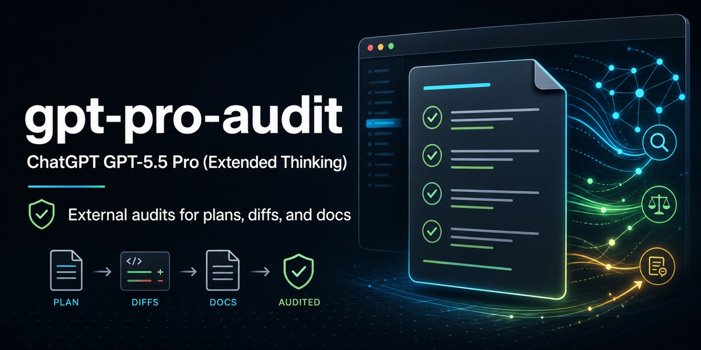

# gpt-pro-audit

[](https://skills.sh/hubeiqiao/gpt-pro-audit/gpt-pro-audit)

## About

A reusable Codex/Claude skill that automatically packages codebase context and sends plans, diffs, documents, and implementation proposals to a strong ChatGPT model running with `Effort Pro` through the user's authenticated Chrome session for an external audit.

This skill sends selected content to ChatGPT/OpenAI through the user's authenticated account; do not use it for secrets or unredacted sensitive data.

Invoking the skill authorizes the selected artifact and its minimum necessary audit context. It does not require a separate "go" confirmation, but it does not authorize a broader payload or override browser and platform confirmation requirements.

ChatGPT does not know your codebase, local files, current branch, or project constraints. This skill is designed to gather and provide that context automatically so the audit is grounded instead of generic.



The skill focuses on:

- packaging enough context for a useful external review
- attaching `@GitHub` and the full audit context in one message, with the exact repo, commit, and PR
- starting automatically after invocation for the selected artifact
- automatically giving ChatGPT the repo/project context it cannot see
- verifying that the visible reasoning setting is exactly `Effort Pro`
- running up to 5 review rounds until GPT Pro accepts the revised plan
- actively revising the artifact between rounds instead of just relaying feedback
- resuming smoothly after browser slowdowns or context compaction with a local audit state file
- disclosing whether the audit will create a normal ChatGPT history record before submission
- avoiding repeated upload retries and using targeted follow-up prompts for later rounds
- using the Chrome plugin workflow safely
- avoiding secret/private-data leaks
- treating ChatGPT as an external reviewer, not an authority
- verifying external claims before applying changes
- reporting accepted, rejected, and unresolved findings clearly

## Files

- `SKILL.md` - the skill to install or copy into an agent skills folder.

## Usage

Install from skills.sh-compatible source:

```bash
npx skills add hubeiqiao/gpt-pro-audit
```

Or copy `SKILL.md` into a skill folder named `gpt-pro-audit`, then invoke it when you want an audit using `Effort Pro` through Chrome.

Example trigger:

```text
Use gpt-pro-audit to send this plan to a strong ChatGPT model with `Effort Pro` for final audit.
```

## Requirements

- Access to the `Effort Pro` reasoning setting. The model name itself does not need to include `Pro`.
- Chrome installed and enabled in the Codex app, with the Chrome connector/plugin available to the agent.
- An authenticated ChatGPT session in that Chrome profile.
- Additional user approval when the payload would expand beyond the selected artifact or task context.
- Awareness that, unless Temporary Chat or no-history mode is used, the audit appears in the user's normal ChatGPT history.

## License

MIT. See [LICENSE](LICENSE).
